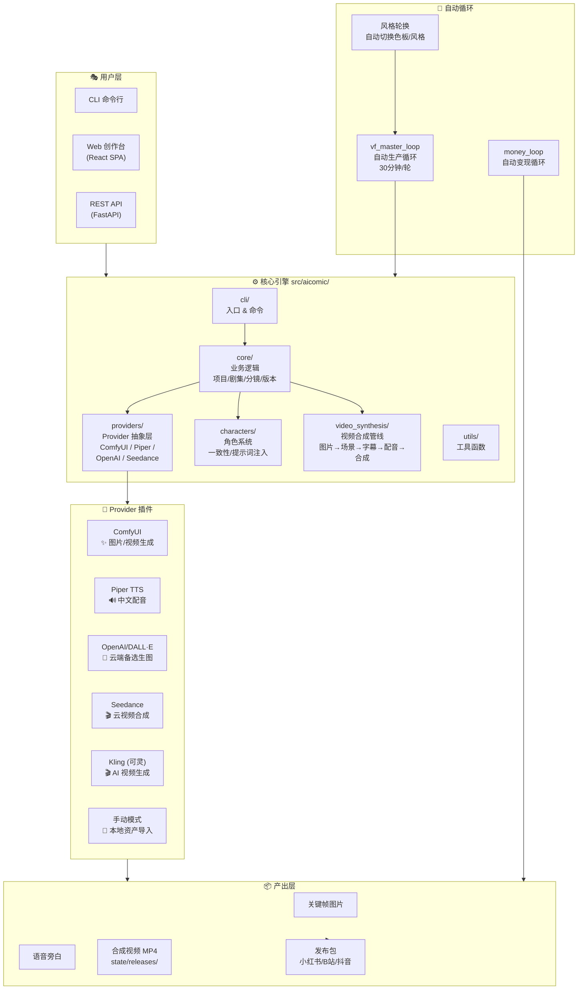
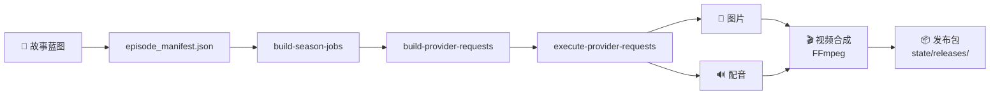
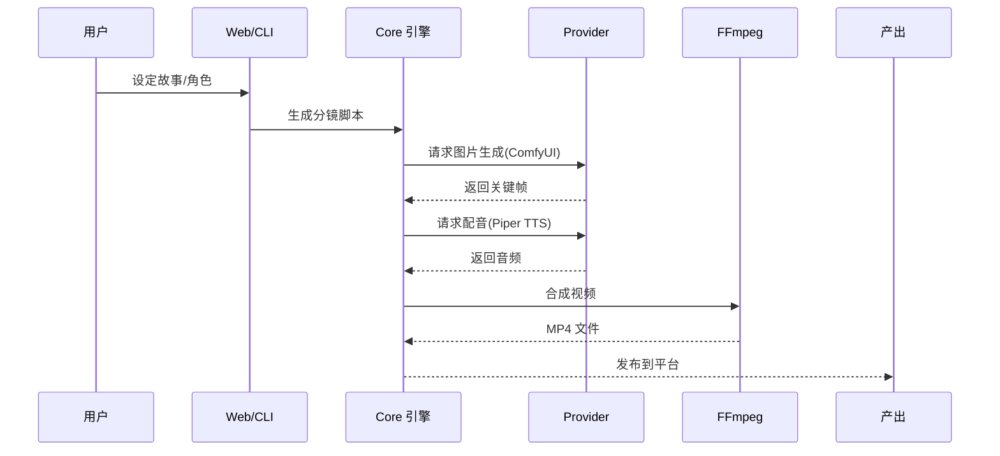
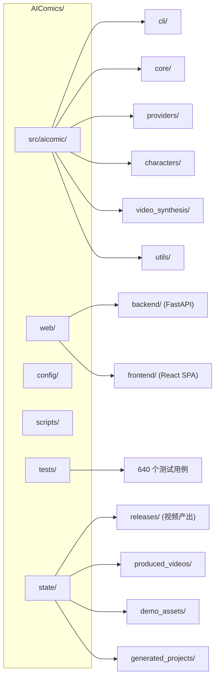

# 🎬 AIComics — AI 漫剧自动生成系统

> **写故事 → 拆镜头 → AI 生成 → 配音 → 发布，全自动一人公司视频工厂**

[](LICENSE)
[](.python-version)
[](tests/)
[](https://github.com/comfyanonymous/ComfyUI)
[]()
[](https://github.com/chfr19820610-cell/AIComics)
[](https://github.com/chfr19820610-cell/AIComics/commits/main)
[-success)](tests/)
[](CHANGELOG.md)

---

## 📺 演示

| Painterly 3D Noir 风格 (E01) | Painterly 3D Noir 风格 (E03) |
|---|---|
|  |  |
|| E01 · 00:33 · 1280×720 | E03 · 01:31 · 1280×720 |

> 🎥 **5 集完整漫剧已产出** — 《我变成僵尸后全校跪求我别死》全 5 集，每集 6 个分镜，总计 **4 分 24 秒** 完整视频内容。
> 风格: **Painterly 3D Noir** + **Hybrid Comic Pop** 双风格轮换
> 色板: `#1A1A2E` `#16213E` `#E94560` `#0F3460` `#FFD700` / `#FF6B35` `#004E64` `#F2C14E` `#5C4D7D` `#00A5CF`
> 视频品质: **1080p/30fps** (HQ) | **720p/24fps** (标准)
> 产出路径: [`state/releases/`](state/releases/) · [`state/produced_videos/`](state/produced_videos/)

---

## ✨ 它能做什么

AIComics 是一个**全本地运行**的 AI 漫剧创作系统。你只需要有一个故事想法，系统会帮你：

| 环节 | 说明 | 技术 |
|------|------|------|
| 📝 **写剧本** | 设定世界观、角色、剧情，自动生成分镜脚本 | 大语言模型 |
| 🎨 **出画面** | 每个分镜生成动漫风格的关键帧图片 | ComfyUI / OpenAI DALL·E |
| 🔊 **配配音** | 每个分镜生成中文语音旁白 | Piper TTS / OpenAI TTS |
| 🎬 **做视频** | 图片+配音合成完整剧集，支持 AI 动态帧 / 视频生成 | FFmpeg / AnimateDiff / Seedance / Kling |
| 📡 **发平台** | 一键发布到小红书/B站/抖音 | social-auto-upload |
| 🔄 **自动循环** | vf_master_loop 后台守护，自动补充资产+风格轮换 | Python 后台进程 |
| 🎨 **多 Provider** | 云端+本地混合架构，故障自动降级 | OpenAI / Seedance / Kling / ComfyUI |

**当前成品示例：** 《我变成僵尸后全校跪求我别死》E01-E05（30 张关键帧 + 30 段配音 + 5 集完整视频）

---

## 🏗️ 系统架构



### 生产管线



### 数据流



---

## 🚀 快速开始

### 前置要求

| 依赖 | 版本 | 用途 |
|------|------|------|
| Python | 3.12+ | 运行时 |
| [ComfyUI](https://github.com/comfyanonymous/ComfyUI) | v0.26.0+ | AI 图片生成（SDXL 模型） |
| [Piper TTS](https://github.com/rhasspy/piper) | latest | 中文语音合成 |
| FFmpeg | 4.4+ | 视频合成 |
| Node.js | 18+ | Web 前端构建 |

### 一键安装

```bash
# 1. 克隆仓库
git clone https://github.com/chfr19820610-cell/AIComics.git
cd AIComics

# 2. 创建 Python 虚拟环境
python3.12 -m venv .venv

# 3. 激活环境 & 安装依赖
source .venv/bin/activate
pip install --upgrade pip
pip install -r requirements-lock.txt

# 4. 配置 ComfyUI 路径
#    编辑 config/aicomic_comfyui_paths.yaml，指向你的 ComfyUI models 目录
#    示例：
#   comfyui:
#     base_path: /path/to/ComfyUI
#     models_dir: /path/to/ComfyUI/models

# 5. 初始化演示数据库
PYTHONPATH="src" .venv/bin/python -m aicomic.cli.main init-demo-db

# 6. 启动系统
bash scripts/start.sh
```

### Docker 部署（推荐）

```bash
# 启动核心服务
docker compose up -d

# 启动 ComfyUI sidecar（含 SDXL 模型）
docker compose -f docker-compose.local-providers.yml up -d

# 查看日志
docker compose logs -f
```

### 启动后访问

| 服务 | 地址 | 说明 |
|------|------|------|
| **创作台** | http://localhost:8000/login | Web SPA 前端 |
| **API** | http://localhost:7860/api/health | FastAPI 健康检查 |
| **ComfyUI** | http://localhost:8188 | ComfyUI Web UI |

默认账号：`creator` / `your-password-here`

---

## 📊 当前状态

| 指标 | 值 |
|------|----|
| 测试通过率 | **640/640** (100%) |
| 验证脚本 | **39/39** (100%) |
| API 端点 | **52** 个 |
| 视频产出 | **5 集完整漫剧**（4 分 24 秒）+ 双风格轮换 |
| 资产完整度 | **60/60**（30 图 + 30 配音） |
| 视频品质 | **1080p/30fps** (HQ 重制版) + **720p/24fps** (标准版) |
| 视频 Provider | **7** 个 (ComfyUI / OpenAI / Seedance / Kling / Piper / OpenAI TTS / 手动) |
| 风格主题 | **2** 种 (Painterly 3D Noir + Hybrid Comic Pop) |
| 最新版本 | **v0.3.0** |
| Python 版本 | **3.12** |
| 许可证 | **Apache 2.0** |

---

## 🧪 运行测试

```bash
# 运行全部 640 个测试
PYTHONPATH="src" .venv/bin/python -m pytest tests/ -v

# 快速模式（跳过耗时测试）
PYTHONPATH="src" .venv/bin/python -m pytest tests/ -q --skip-slow

# 运行特定模块测试
PYTHONPATH="src" .venv/bin/python -m pytest tests/test_providers/ -v
PYTHONPATH="src" .venv/bin/python -m pytest tests/test_characters/ -v
```

---

## 🔄 无限自循环

系统自带轻量后台循环引擎，自动监控生产状态并补充资产：

```bash
# 启动生产 + 赚钱循环
PYTHONPATH="src" .venv/bin/python scripts/vf_master_loop.py &

# 查看循环日志
tail -f logs/vf_loop.log
```

定时任务会被自动发现和补充，无需手动干预。系统支持：

- **风格轮换** — 每轮自动切换色板/视觉风格（Painterly 3D Noir → Hybrid Comic Pop → Cinematic Liquid Glass）
- **资产补充** — 自动检测缺失的图片/音频并排队补充
- **自动发布** — 合成完成后自动打包发布包

---

## ✨ v0.2.0 新功能

| 功能 | 说明 |
|------|------|
| **🧩 供应商抽象层** | 统一的 Provider 接口，支持 ComfyUI / OpenAI / Seedance / Kling / 手动等多种图片/视频生成后端，云端+本地混合架构，故障自动降级 |
| **👤 角色系统** | 角色定义、一致性检测、提示词注入、参考图管理，让同一角色在不同分镜中保持外形统一 |
| **📋 分镜版本管理** | 分镜可创建多个版本，对比选择最佳效果，支持回滚 |
| **🎬 视频合成管线** | 端到端视频合成：图片→场景→字幕→配音→合成，支持批量处理 |
| **✅ 640 测试覆盖** | 从 314 提升至 640 测试，新增 Provider 抽象层、角色系统、分镜版本管理等专项测试，验证脚本 39/39 全通过 |
| **🎨 风格轮换引擎** | 自动轮换视觉风格和色板，每条漫剧可拥有不同艺术风格 |
| **🔄 无限自循环** | vf_master_loop 后台守护，自动生产+补充+发布，无需人工干预 |

---

## 🗂️ 项目结构



| 目录 | 说明 |
|------|------|
| `src/aicomic/` | 核心引擎 — CLI / 业务逻辑 / Provider 抽象层 / 角色系统 / 视频合成 |
| `web/backend/` | FastAPI 后端（52 个 API 端点） |
| `web/frontend/` | React SPA 创作台 |
| `config/` | 配置文件（ComfyUI 路径、Provider 配置） |
| `scripts/` | 运维脚本（vf_master_loop、启动脚本） |
| `tests/` | 640 个测试用例 |
| `state/releases/` | 已合成的 MP4 视频产出 |
| `state/produced_videos/` | 视频工厂产出目录 |

---

## 🆕 v0.3.0 新功能

| 功能 | 说明 |
|------|------|
| **🎬 1080p/30fps 高清输出** | 视频品质从 720p 升级至全高清，添加 LUT 色彩校正，修复 CRF 不一致 |
| **🎨 双风格轮换** | Painterly 3D Noir + Hybrid Comic Pop 自动切换，每轮自动生成不同风格视频 |
| **🔌 Kling (快手可灵) Provider** | `text2video` + `image2video` + JWT 认证，快手 SOTA 视频生成 |
| **⚡ ComfyUI 加速模式** | `local_comfyui_video_fast` 新 workflow，预览速度提升 2-2.5x |
| **🔒 安全审计** | strix + pentest 全量扫描，9 项安全检视，修复 .gitignore / CORS / 认证问题 |
| **📋 20+ Agent 产出整合** | 视频导演审查 / 品质 Prompt 模板 / 视频工作流指南 / Blender 可行性 / 竞品分析 / UX 审计等 |
| **🌐 社区基础设施** | CI/CD 自动化 + Issue/PR 模板 + 每日升级检测 |
| **🎬 AIComics demo_reel** | 精选演示短片 MP4，展示系统能力 |

---

## 🛤️ 路线图

- [x] 基础漫剧管线 (故事→分镜→图片→配音)
- [x] CLI + Web API + SPA 三端入口
- [x] 640 测试全通过
- [x] 供应商抽象层 (ComfyUI/Piper/OpenAI/Seedance/Kling)
- [x] 角色系统 (定义/一致性/提示词注入/参考图)
- [x] 分镜版本管理
- [x] 自动风格轮换引擎 + 无限自循环
- [x] 1080p/30fps 高清视频输出
- [x] 云端+本地混合 Provider 架构
- [x] 安全审计 + 基础设施 (CI/CD + 模板)
- [ ] 漫剧专用模板系统
- [ ] 小说→漫剧一站式管道
- [ ] 多语言配音 & 字幕
- [ ] 发布平台自动集成（小红书/B站/抖音一键发布）
- [ ] 云端轻量模式
- [ ] 社区模板市场
- [ ] Blender 三渲二 Provider

---

## 📄 许可证

Apache 2.0 © 2026 [Eric Chen](https://github.com/chfr19820610-cell)

---

## 🤝 贡献

Issues 和 PR 都欢迎！提交前请确保测试通过。

```bash
# 运行测试确认
PYTHONPATH="src" .venv/bin/python -m pytest tests/ -q
```
