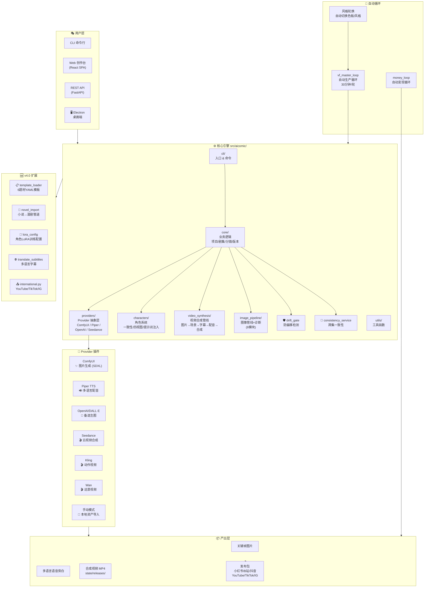
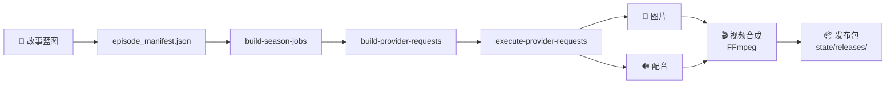
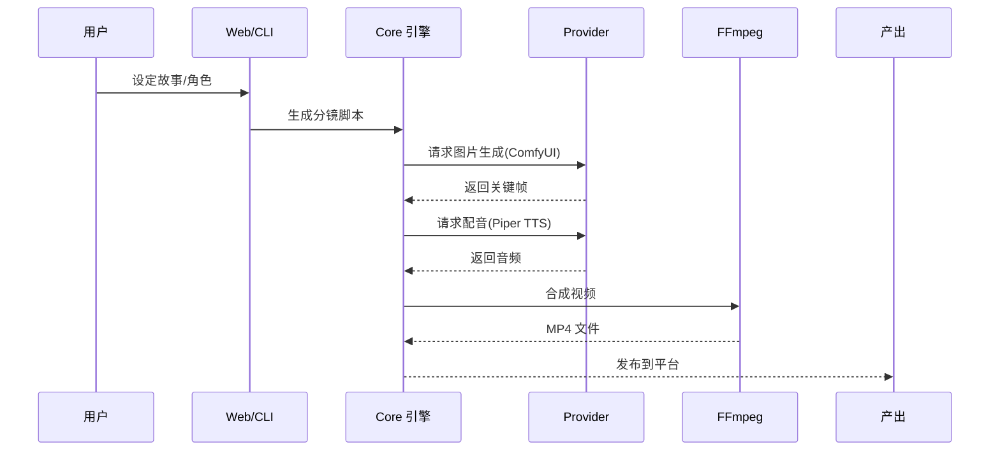
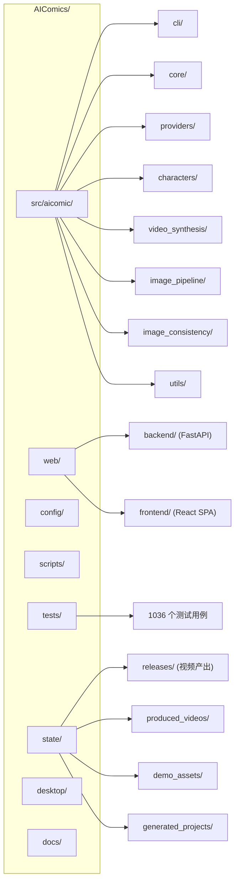

# 🎬 AIComics — AI 漫剧自动生成系统

> **写故事 → 拆镜头 → AI 生成 → 配音 → 发布，全自动一人公司视频工厂**

[](https://github.com/chfr19820610-cell/AIComics/releases)
[](https://github.com/chfr19820610-cell/AIComics)
[](https://github.com/chfr19820610-cell/AIComics/fork)
[](https://github.com/chfr19820610-cell/AIComics/actions/workflows/ci.yml)
[](LICENSE)
[](.python-version)
[](https://github.com/comfyanonymous/ComfyUI)
[](https://github.com/chfr19820610-cell/AIComics/commits/main)
[](https://chfr1982.gumroad.com)

---

## 🛒 Commercial Releases — Buy on Gumroad

> **10 products available** — AI-animated donghua, production toolkits, handbooks, games, and novels.
> All instantly downloadable. No DRM. **Every paid product is $0.99.** Use code `EARLYBIRD50` for 50% off.
> Use offer codes below for 50% off.

### 📺 AI Animation (Donghua)

| Product | Price | Link |
|---------|-------|------|
| **Nine Turns of the Crimson Heavens — Complete Season (Ep 1–12)** · 九转丹霄全季 | $0.99 | [Gumroad](https://chfr1982.gumroad.com/l/nine-turns-complete-season) |
| **Nine Turns of the Crimson Heavens — Episode 1** (The Night the Village Burned) | **FREE** | [Gumroad](https://chfr1982.gumroad.com/l/nine-turns-episode-1) |
| **Starfall Chronicle EP2 — Under the Dome** (AI Donghua) | $0.99 | [Gumroad](https://chfr1982.gumroad.com/l/starfall-chronicle-ep2) |
| **Free: 30s White-Label AI Animation Sample** *(免费样品)* | Free | [Gumroad](https://chfr1982.gumroad.com/l/free-ai-animation-sample) |

### 🛠️ Toolkits & Handbooks

| Product | Price | Link |
|---------|-------|------|
| **Vertical Manhua AI Toolkit** · 竖屏漫剧制作工具包 | $0.99 | [Gumroad](https://chfr1982.gumroad.com/l/vertical-manhua-ai-toolkit) |
| **AICG Animation Production Handbook** · AI 动画工作流手册 | $0.99 | [Gumroad](https://chfr1982.gumroad.com/l/aicg-handbook) |
| **White-Label AI Animation Suite** · 白标AI动画套件 | $0.99 | [Gumroad](https://chfr1982.gumroad.com/l/white-label-ai-animation) |
| **Crypto Spread Scanner** — Arbitrage Detection | $0.99 | [Gumroad](https://chfr1982.gumroad.com/l/crypto-spread-scanner) |

### 🎮 Games & Novels

| Product | Price | Link |
|---------|-------|------|
| **Starfall Night — HTML5 Arcade Game** | $0.99 | [Gumroad](https://chfr1982.gumroad.com/l/starfall-night-game) |
| **Nine Heavens Ascension — Xianxia Novel** · 九天飞升 | $0.99 | [Gumroad](https://chfr1982.gumroad.com/l/nine-heavens-ascension-novel) |

> 🔗 **Full store**: https://chfr1982.gumroad.com
> 📧 Custom / white-label inquiries: chfr19820610@gmail.com

### 🎁 Launch Offers (50% Off All Paid Products)

> **50% OFF any product** — Use code **`EARLYBIRD50`** at checkout → works on every paid product (20 uses per product)
>
> **Episode 1 is FREE** — no code needed, just download → [Get Episode 1 →](https://chfr1982.gumroad.com/l/nine-turns-episode-1)
>
> **Free 30s sample** — no signup required → [Watch now →](https://chfr1982.gumroad.com/l/free-ai-animation-sample)
>
> ⚡ All codes are limited. Don't wait!

### 👉 Start free, then get the full season for $0.99

> **Watch the free 30-second sample** — no email required. Then grab **Episode 1 for free** to see if you like the style.
>
> **Want the whole story?** The complete 12-episode season is just **$0.99** (use code `EARLYBIRD50` → $0.49) — [Get the full season →](https://chfr1982.gumroad.com/l/nine-turns-complete-season)
>
> **Building your own AI animation pipeline?** The [AICG Animation Production Handbook](https://chfr1982.gumroad.com/l/aicg-handbook) ($0.99, or $0.49 with `EARLYBIRD50`) documents the full ComfyUI + Blender + Remotion workflow used to produce every episode. The open-source system you're looking at right now is free; the handbook teaches you how to use it end-to-end.

---

## 📺 演示

| Painterly 3D Noir 风格 (E01) | Painterly 3D Noir 风格 (E03) |
|---|---|
|  |  |
| E01 · 00:24 · 1280×720 | E03 · 01:31 · 1280×720 |

> 🎥 **5 集完整漫剧已产出** — 《我变成僵尸后全校跪求我别死》全 5 集，每集 6 个分镜，总计 **4 分 24 秒** 完整视频内容。
> 风格: **Painterly 3D Noir** (`#1A1A2E` `#16213E` `#E94560` `#0F3460` `#FFD700`)
> 产出路径: [`state/releases/`](state/releases/) · [`state/produced_videos/`](state/produced_videos/)

---

## ✨ 它能做什么

AIComics 是一个**全本地运行**的 AI 漫剧创作系统。v4.0 已支持从故事到发布的完整管线：

| 环节 | 说明 | 技术 |
|------|------|------|
| 📝 **写剧本** | 设定世界观、角色、剧情，自动生成分镜脚本 | 大语言模型 |
| 📖 **小说导入** | 小说文本→章节拆分→整季蓝图→分镜计划 | `import_novel()` |
| 🎨 **出画面** | 每个分镜生成动漫风格的关键帧图片 + 角色四视图 | ComfyUI + SDXL |
| 🛡️ **防偏移** | Drift Gate 检测画面偏离参考图 → PASS/WARN/FAIL | `drift_gate.py` |
| 🔗 **跨集一致** | 跨集角色一致性检查 | `consistency_service.py` |
| 🔊 **配配音** | 多语言TTS（中/英/日/韩）+ 字幕翻译 | Piper TTS + `translate_subtitles()` |
| 🎬 **做视频** | 多模型路由（动作→Kling/对话→Seedance/远景→Wan）+ FLF插值 | `VideoRouter` + FFmpeg |
| 📡 **发平台** | YouTube/TikTok/Instagram + 小红书/B站/抖音 | `international.py` + social-auto-upload |
| 🖥️ **桌面端** | Electron 桌面应用 | `desktop/` |

---

## 🆕 v4.0 新功能 — 14项升级 · 4优先级 · 1036测试零回归

基于 GitHub 竞品调研 + v3.0 深度审计，补齐断链、防偏移、跨集一致性、发布集成。

### P0 — 核心体验
| 功能 | 模块 | 说明 |
|------|------|------|
| **角色四视图** | `execute_asset_generation` | 正面/侧面/背面/45° 四视图自动生成 |
| **多模型视频路由** | `VideoRouter.route()` | 动作→Kling / 对话→Seedance / 远景→Wan |
| **防偏移 Drift Gate** | `drift_gate.py` | `check(shots, refs)` → PASS/WARN/FAIL + drift_score |
| **多语言TTS+字幕** | `translate_subtitles()` | 中→英/日/韩 字幕 + 多语言TTS路由 |

### P1 — 生产力
| 功能 | 模块 | 说明 |
|------|------|------|
| **跨集一致性** | `consistency_service.py` | `check_cross_episode_consistency()` |
| **发布平台集成** | `international.py` | YouTube/TikTok/Instagram selenium 上传 |
| **模板系统** | `template_loader.py` | 6题材YAML模板（恐怖/爱情/职场/修仙/悬疑/甜宠）|

### P2/P3 — 扩展能力
| 功能 | 模块 | 说明 |
|------|------|------|
| **LoRA训练配置** | `lora_config.py` | SDXL角色LoRA训练配置生成 |
| **Docker一键部署** | 7个compose文件 | dev/prod/gpu/cpu/comfyui/all-in-one |
| **小说→漫剧管道** | `import_novel()` | 小说→章节→整季蓝图→分镜计划 |
| **Electron桌面端** | `desktop/` | Electron main + preload 脚手架 |
| **☁️ 云端轻量模式** | `cloud_mode.py` | `AICOMIC_CLOUD=1` 跳过local providers，全走API，镜像<500MB |
| **🏪 社区模板市场** | `template_market.py` | install/uninstall/share/browse/preview 全CLI支持，base64分发 |

### 测试
- v3.0 基线 992 → v4.0 **1036 passed, 1 skipped, 0 failed**（零回归）

---

## 🆕 v3.0 新功能 — 三线渲染 + 角色一致性 + 视频生成

### 三线渲染架构 (2D / 2.5D / 3D)

```bash
aicomic render --list-modes              # 查看三档就绪状态
aicomic render --mode 2d                 # 2D: ffmpeg Ken Burns
aicomic render --mode 2.5d               # 2.5D: Blender Cycles 赛璐珑
aicomic render --mode 3d                 # 3D: Tripo→Mixamo→cel-shader
```

| 功能 | 模块 | 说明 |
|------|------|------|
| **三线渲染路由** | `render/mode_router.py` | 2D/2.5D/3D三档选择 + 按镜头类型自动路由 |
| **2D 渲染线** | `render/two_d/` | ffmpeg Ken Burns zoom/pan + 关键帧插值 (v1.0成熟) |
| **2.5D 渲染线** | `render/two_half_d/` | Blender Cycles赛璐珑材质 + 轨道相机±12° (100/100放行) |
| **3D 渲染线** | `render/three_d/` | Tripo图生3D→Mixamo绑骨→cel-shader渲染 (gate 5/5) |
| **Triple-Lock 角色一致性** | `image_consistency/triple_lock.py` | IPAdapter FaceID(0.75) + ControlNet(0.8) + FaceDetailer(0.4) |
| **多模型视频路由** | `providers/video_router.py` | 动作→Kling / 对话→Seedance / 远景→Wan |
| **FLF 首尾帧插值** | `providers/flf_interpolator.py` | 首帧+尾帧→模型插值运动，保证shot间连续性 |
| **图像管线 + 诊断** | `image_pipeline/` (8模块) | 抠图→生图→放大→合成 + 就绪诊断 |

---

## 🆕 v2.0 功能 — 6项扩展（模板/小说/多语言/发布/云/社区）

| 功能 | CLI 命令 | Web API | 说明 |
|------|---------|---------|------|
| **漫剧模板系统** | `list-templates` / `template-blueprint --template horror` | `GET /api/templates` | 6 题材 YAML 模板（恐怖/爱情/职场/修仙/悬疑/甜宠） |
| **小说→漫剧管道** | `novel-import --novel-file book.txt --template mystery` | `POST /api/novel/import` | 小说文本→章节拆分→整季蓝图→分镜计划 |
| **多语言配音&字幕** | `translate-subtitles --srt-file zh.srt --languages en,ja,ko` | `POST /api/translate` | 中→英/日/韩 字幕翻译 + 多语言 TTS 路由 + 翻译记忆库 |
| **发布平台集成** | `publish --video v.mp4 --platforms douyin,xiaohongshu,bilibili` | `GET /api/publish/status` · `POST /api/publish/schedule` · `GET /api/publish/analytics/summary` | 国内 3 平台 + YouTube/TikTok/Instagram + 定时发布 + 数据回收 |
| **云端轻量模式** | `AICOMIC_CLOUD=1` 环境变量 | — | 跳过 local_providers 全走 API，Docker 镜像 < 500MB |
| **社区模板市场** | `install-template --url <url>` / `share-template --name horror` | — | 模板安装/卸载/分享/在线浏览/预览 |

### 模板系统

```bash
# 列出所有模板
aicomic list-templates

# 用模板生成蓝图
aicomic template-blueprint --hook "村里老人说，夜里不能回头看井口。" --template horror

# 初始化项目时指定模板
aicomic init-project --name "我的恐怖漫剧" --template horror

# 安装社区模板
aicomic install-template --url <base64-url>

# 分享自己的模板
aicomic share-template --name horror
```

### 小说→漫剧管道

```bash
# 导入小说→生成整季蓝图
aicomic novel-import --novel-file novel.txt --template mystery --episodes 12 --shots-per-episode 10
```

### 发布平台

```bash
# 检查就绪状态
aicomic check-publish --platforms douyin,xiaohongshu,bilibili

# 发布视频
aicomic publish --video output.mp4 --platforms douyin,xiaohongshu
```

### 多语言

```bash
# 翻译字幕
aicomic translate-subtitles --srt-file zh.srt --languages en,ja,ko --output-dir reports/subtitles
```

**当前成品示例：** 《我变成僵尸后全校跪求我别死》E01-E05（30 张关键帧 + 30 段配音 + 5 集完整视频）

---

## 🏗️ 系统架构


```mermaid
graph TB
    subgraph User["🎭 用户层"]
        CLI["CLI 命令行"]
        WEB["Web 创作台<br/>(React SPA)"]
        API["REST API<br/>(FastAPI)"]
        DESKTOP["🖥️ Electron<br/>桌面端"]
    end

    subgraph Core["⚙️ 核心引擎 src/aicomic/"]
        direction TB
        CLI_CORE["cli/<br/>入口 & 命令"]
        CORE_BP["core/<br/>业务逻辑<br/>项目/剧集/分镜/版本"]
        PROV["providers/<br/>Provider 抽象层<br/>ComfyUI / Piper /<br>OpenAI / Seedance"]
        CHAR["characters/<br/>角色系统<br/>一致性/四视图/提示词注入"]
        VIDEO_SYNTH["video_synthesis/<br/>视频合成管线<br/>图片→场景→字幕→配音→合成"]
        IMG_PIPE["image_pipeline/<br/>图像管线+诊断<br/>(8模块)"]
        DRIFT["🛡️ drift_gate<br/>防偏移检测"]
        CONSIST["🔗 consistency_service<br/>跨集一致性"]
        UTILS["utils/<br/>工具函数"]
        CLI_CORE --> CORE_BP
        CORE_BP --> PROV
        CORE_BP --> CHAR
        CORE_BP --> VIDEO_SYNTH
        CORE_BP --> IMG_PIPE
        CORE_BP --> DRIFT
        CORE_BP --> CONSIST
    end

    subgraph Providers["🔌 Provider 插件"]
        COMFY["ComfyUI<br/>✨ 图片生成 (SDXL)"]
        PIPER["Piper TTS<br/>🔊 多语言配音"]
        OPENAI["OpenAI/DALL·E<br/>🎨 备选生图"]
        SEEDANCE["Seedance<br/>🎬 云视频合成"]
        KLING["Kling<br/>🎬 动作视频"]
        WAN["Wan<br/>🎬 远景视频"]
        MANUAL["手动模式<br/>📁 本地资产导入"]
    end

    subgraph V4["🆕 v4.0 扩展"]
        TEMPLATES["📋 template_loader<br/>6题材YAML模板"]
        NOVEL["📖 novel_import<br/>小说→漫剧管道"]
        LORA["🎨 lora_config<br/>角色LoRA训练配置"]
        I18N["🌐 translate_subtitles<br/>多语言字幕"]
        PUBLISH_INTL["📤 international.py<br/>YouTube/TikTok/IG"]
    end

    subgraph Output["📦 产出层"]
        IMAGES["关键帧图片"]
        AUDIO["多语言语音旁白"]
        VIDEO["合成视频 MP4<br/>state/releases/"]
        PUBLISH["发布包<br/>小红书/B站/抖音<br/>YouTube/TikTok/IG"]
    end

    subgraph Automation["🔄 自动循环"]
        VF_LOOP["vf_master_loop<br/>自动生产循环<br/>30分钟/轮"]
        MONEY_LOOP["money_loop<br/>自动变现循环"]
        STYLE_ROTATION["风格轮换<br/>自动切换色板/风格"]
    end

    User --> Core
    Core --> V4
    PROV --> Providers
    Providers --> Output
    Output --> PUBLISH
    VF_LOOP --> Core
    MONEY_LOOP --> Output
    STYLE_ROTATION --> VF_LOOP
```

### 生产管线


```mermaid
flowchart LR
    A["📖 故事蓝图"] --> B["episode_manifest.json"]
    B --> C["build-season-jobs"]
    C --> D["build-provider-requests"]
    D --> E["execute-provider-requests"]
    E --> F["🎨 图片"]
    E --> G["🔊 配音"]
    F --> H["🎬 视频合成<br/>FFmpeg"]
    G --> H
    H --> I["📦 发布包<br/>state/releases/"]
```

### 数据流


```mermaid
sequenceDiagram
    participant U as 用户
    participant W as Web/CLI
    participant C as Core 引擎
    participant P as Provider
    participant F as FFmpeg
    participant O as 产出

    U->>W: 设定故事/角色
    W->>C: 生成分镜脚本
    C->>P: 请求图片生成(ComfyUI)
    P-->>C: 返回关键帧
    C->>P: 请求配音(Piper TTS)
    P-->>C: 返回音频
    C->>F: 合成视频
    F-->>C: MP4 文件
    C-->>O: 发布到平台
```

---

## 🚀 快速开始

### 前置要求

| 依赖 | 版本 | 用途 |
|------|------|------|
| Python | 3.12+ | 运行时 |
| [ComfyUI](https://github.com/comfyanonymous/ComfyUI) | v0.26.0+ | AI 图片生成（SDXL 模型） |
| [Piper TTS](https://github.com/rhasspy/piper) | latest | 中文语音合成 |
| FFmpeg | 4.4+ | 视频合成 |
| Node.js | 20+ | Web 前端构建（umijs/max） |

### 一键安装

```bash
# 1. 克隆仓库
git clone https://github.com/chfr19820610-cell/AIComics.git
cd AIComics

# 2. 创建 Python 虚拟环境
python3.12 -m venv .venv

# 3. 激活环境 & 安装依赖
source .venv/bin/activate
pip install --upgrade pip
pip install -r requirements-lock.txt

# 4. 配置 ComfyUI 路径
#    编辑 config/aicomic_comfyui_paths.yaml，指向你的 ComfyUI models 目录
#    示例：
#   comfyui:
#     base_path: /path/to/ComfyUI
#     models_dir: /path/to/ComfyUI/models

# 5. 初始化演示数据库
PYTHONPATH="src" .venv/bin/python -m aicomic.cli.main init-demo-db

# 6. 启动系统
bash scripts/start.sh
```

### Docker 部署（推荐）

```bash
# 一键启动（自动生成 .env.docker.local、local_providers/ 骨架）
bash scripts/start.sh

# 仅核心（不含 ComfyUI/Piper sidecar）
bash scripts/start.sh --no-comfyui

# 手动等效命令（start.sh 的内部实现）
docker compose -f docker-compose.yml build && docker compose -f docker-compose.yml up -d
# ComfyUI/Piper sidecar 需以覆盖层方式组合（独立使用 local-providers 文件会报错）：
docker compose -f docker-compose.yml -f docker-compose.local-providers.yml up -d

# 查看日志
docker compose logs -f
```

> **注意**：`.env.docker.local` / `.env.production.local` 为本地密钥文件（被 .gitignore 排除）。
> `start.sh` 首次运行会自动从 `.env.production.example` 生成。直接 `docker compose up -d`
> 前请确保该文件存在。

### 启动后访问

| 服务 | 地址 | 说明 |
|------|------|------|
| **创作台** | http://localhost:8000/login | Web SPA 前端 |
| **API** | http://localhost:7860/api/health | FastAPI 健康检查 |
| **ComfyUI** | http://localhost:8188 | ComfyUI Web UI |

默认账号：`creator` / `your-password-here`

---

## 📊 当前状态

| 指标 | 值 |
|------|----|
| **版本** | **4.0.0** |
| 测试通过率 | **1036/1037** (99.9%) |
| 验证脚本 | **39/39** (100%) |
| API 端点 | **52** 个 |
| 视频产出 | **5 集完整漫剧**（4 分 24 秒） |
| 资产完整度 | **60/60**（30 图 + 30 配音） |
| Python 版本 | **3.12** |
| 许可证 | **Apache 2.0** |

---

## 🧪 运行测试

```bash
# 运行全部 1036 个测试
PYTHONPATH="src" .venv/bin/python -m pytest tests/ -v

# 快速模式（跳过耗时测试）
PYTHONPATH="src" .venv/bin/python -m pytest tests/ -q --skip-slow

# 运行特定模块测试
PYTHONPATH="src" .venv/bin/python -m pytest tests/test_providers/ -v
PYTHONPATH="src" .venv/bin/python -m pytest tests/test_characters/ -v
```

---

## 🔄 无限自循环

系统自带轻量后台循环引擎，自动监控生产状态并补充资产：

```bash
# 启动生产 + 赚钱循环
PYTHONPATH="src" .venv/bin/python scripts/vf_master_loop.py &

# 查看循环日志
tail -f logs/vf_loop.log
```

定时任务会被自动发现和补充，无需手动干预。系统支持：

- **风格轮换** — 每轮自动切换色板/视觉风格（Painterly 3D Noir → Hybrid Comic Pop → Cinematic Liquid Glass）
- **资产补充** — 自动检测缺失的图片/音频并排队补充
- **自动发布** — 合成完成后自动打包发布包

---

## ✨ v1.0.0 核心功能

| 功能 | 说明 |
|------|------|
| **🧩 供应商抽象层** | 统一的 Provider 接口，支持 ComfyUI / OpenAI / Seedance / 手动 等多种图片生成后端，可热切换 |
| **👤 角色系统** | 角色定义、一致性检测、提示词注入、参考图管理，让同一角色在不同分镜中保持外形统一 |
| **📋 分镜版本管理** | 分镜可创建多个版本，对比选择最佳效果，支持回滚 |
| **🎬 视频合成管线** | 端到端视频合成：图片→场景→字幕→配音→合成，支持批量处理 |
| **🏗️ 声明式管线** | YAML 清单定义生产流程，审批门+断点续跑+协调器，管线可编排可中断可恢复 |
| **🎨 ComfyUI 真实出图** | SDXL 25步 1024×1024 真实出图验证脚本 + Docker 构建代理修复 |
| **✅ 1036 测试覆盖** | 从 314 提升至 1036 测试，覆盖 Provider 抽象层、角色系统、分镜版本管理、管线基础设施、v4.0 P0-P3 功能 |
| **🎨 风格轮换引擎** | 自动轮换视觉风格和色板，每条漫剧可拥有不同艺术风格 |
| **🔄 无限自循环** | vf_master_loop 后台守护，自动生产+补充+发布，无需人工干预 |
| **🐳 Docker 全栈部署** | docker-compose 一键启动（前端+后端+PostgreSQL+Redis），支持 local/production 双环境 |
| **🌐 Web 控制台** | 前端 Web UI 管理漫剧生产全流程 |

---

## 🗂️ 项目结构


```mermaid
graph LR
    subgraph Root["AIComics/"]
        SRC["src/aicomic/"]
        WEB["web/"]
        CFG["config/"]
        SCR["scripts/"]
        TST["tests/"]
        ST["state/"]
        DSK["desktop/"]
        DOCS["docs/"]
    end

    SRC --> CLI["cli/"]
    SRC --> CORE["core/"]
    SRC --> PROV2["providers/"]
    SRC --> CHAR2["characters/"]
    SRC --> VS["video_synthesis/"]
    SRC --> IMG2["image_pipeline/"]
    SRC --> IC["image_consistency/"]
    SRC --> UTL["utils/"]

    WEB --> BE["backend/ (FastAPI)"]
    WEB --> FE["frontend/ (React SPA)"]

    TST --> T1036["1036 个测试用例"]

    ST --> REL["releases/ (视频产出)"]
    ST --> PV["produced_videos/"]
    ST --> DA["demo_assets/"]
    ST --> GP["generated_projects/"]
```

| 目录 | 说明 |
|------|------|
| `src/aicomic/` | 核心引擎 — CLI / 业务逻辑 / Provider 抽象层 / 角色系统 / 视频合成 / 图像管线 |
| `src/aicomic/image_consistency/` | 角色一致性 — Triple-Lock + Drift Gate + 跨集检查 |
| `src/aicomic/image_pipeline/` | 图像管线 — 抠图→生图→放大→合成 + 就绪诊断 (8模块) |
| `web/backend/` | FastAPI 后端（52 个 API 端点） |
| `web/frontend/` | React SPA 创作台 |
| `desktop/` | Electron 桌面端 (v4.0) |
| `config/` | 配置文件（ComfyUI 路径、Provider 配置、6题材模板） |
| `scripts/` | 运维脚本（vf_master_loop、启动脚本） |
| `tests/` | 1036 个测试用例 |
| `state/releases/` | 已合成的 MP4 视频产出 |
| `state/produced_videos/` | 视频工厂产出目录 |

---

## 🛤️ 路线图

- [x] 基础漫剧管线 (故事→分镜→图片→配音)
- [x] CLI + Web API + SPA 三端入口
- [x] 1036 测试全通过
- [x] 供应商抽象层 (ComfyUI/Piper/OpenAI/Seedance)
- [x] 角色系统 (定义/一致性/提示词注入/参考图)
- [x] 分镜版本管理
- [x] 自动风格轮换引擎 + 无限自循环
- [x] v4.0: 角色四视图 + 防偏移Drift Gate + 跨集一致性
- [x] v4.0: 多模型视频路由 (Kling/Seedance/Wan) + FLF插值
- [x] v4.0: 多语言TTS + 字幕翻译
- [x] v4.0: 漫剧模板系统 (6题材YAML模板)
- [x] v4.0: 小说→漫剧管道 (import→split→plan)
- [x] v4.0: 发布平台集成 (YouTube/TikTok/IG)
- [x] v4.0: LoRA训练配置 + Docker一键部署 + Electron桌面端
- [x] v4.0: 云端轻量模式 — `AICOMIC_CLOUD=1` 环境变量 + Dockerfile.cloud (<500MB)
- [x] v4.0: 社区模板市场 — install/uninstall/share/browse/preview 模板全CLI支持
- [ ] v5.0 路线图待定（Web模板市场UI / 实时协作 / 更多视频模型接入）

---

## 🧭 分支说明与开源发布

| 分支 | 内容 | 说明 |
|------|------|------|
| `main` | **可部署的 AIComics 系统**（当前默认分支） | Docker 化 + docker-compose 一键部署 + 前端后端全栈 |
| `archive/legacy` | 早期静态 HTML 视觉小说站（35 个提交） | 历史资产保留，仅供追溯参考，不含本系统代码 |
| `feat/acom-0.6-p0` | ACOM-0.6.0 管线基础设施 + 部署修复 | 与 `main` 同 commit（`2f35fb4`），安全网分支 |
| `gh-pages` | GitHub Pages 静态站 | 独立部署分支 |

> 说明：公开 `main` 曾承载一批无关的静态 HTML 页面提交（`index.html`/`v2*.html`/`ai-vn-game` 等）。
> 为让 AIComics 以**可部署系统**对外公开，已将含全部部署修复的可部署系统提升为公开 `main`，
> 原静态站 35 个提交完整迁移至 `archive/legacy` 分支保留，未丢失任何历史数据。

> ⚠️ **部署前提（联网环境）**：`docker compose build` 需要联网拉取基础镜像
> （`node:18-alpine`、`python:3.12-slim` 等）。首次部署请在有网络的环境执行
> `bash scripts/start.sh` 完成完整镜像构建。

---

## 📄 许可证

Apache 2.0 © 2026 [Eric Chen](https://github.com/chfr19820610-cell)

---

## 🤝 贡献

Issues、PR、Discussions 都欢迎！详见 [CONTRIBUTING.md](CONTRIBUTING.md)。

提交前请确保测试通过：

```bash
# 运行测试确认
PYTHONPATH="src" .venv/bin/python -m pytest tests/ -q
```

### ⭐ Star History

[](https://star-history.com/#chfr19820610-cell/AIComics&Date)
