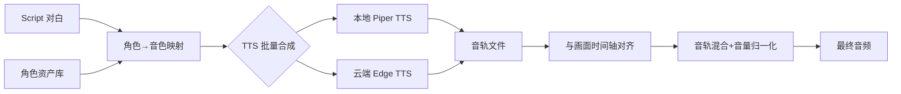

# PRD: 视频合成管线 (Video Synthesis Pipeline)
版本: v1.0
日期: 2026-07-19
产品经理: AIComics PM Agent (product-manager + product-trend-researcher)

---

## 1. 背景与动机

### 1.1 市场背景

AI 漫剧（Animated Comic Drama）进入视频化爆发期：

- **全球 Webtoon 市场 $14.02B**（2026），AI 漫画工具市场 $15.9B+（CAGR 33.1%）
- **中国 AI 漫剧市场规模约 240 亿元**（2026 年），用户规模突破 2.8 亿
- 2026 年 AI 视频生成突破"秒级"限制，中长视频商业化应用正在落地——广告、短视频、**漫剧**是三大落地场景（快思慢想研究院 & 新华社 2026 报告）
- **可灵 Kling 3.0**（快手）首推 VIDEO 3.0 Omni，支持 15s 原生音频+多镜头叙事
- **海螺 AI I2V-01-Live**（MiniMax）图生视频单月访问量增长 800%
- **即梦 Seedance 2.0**（字节）多镜头叙事+角色一致，AI 视频第一梯队
- YouTube 中文 AI 漫剧频道订阅量已达数十万级，视频合成是变现最后一公里

### 1.2 当前能力分析

Phase 1（角色一致性系统）已交付：
- ✅ 角色资产管理（SQLite CRUD）
- ✅ Prompt 注入（角色描述自动增强）
- ✅ Script 角色解析（`[角色名]` → 角色匹配）
- ✅ 8 个 API 端点
- ✅ 36 项测试全通过

**但视频输出能力严重不足：**

| 能力项 | 当前状态 | 差距 |
|--------|---------|------|
| **预览视频** | imageio 纯图片拼接，6fps，无音频，无动效 | ❌ 无可观看性 |
| **发布视频** | 同预览但 8fps，无本质区别 | ❌ 无法发布 |
| **配音** | 仅有 Audio Plan JSON + 静音 WAV 占位，无真实 TTS | ❌ 无配音 |
| **字幕** | SRT 文件生成，但未嵌入视频 | ❌ 无字幕 |
| **镜头动效** | 无 Ken Burns / 镜头运动 | ❌ 静态 |
| **AI 图生视频** | 仅依赖外部 ComfyUI 节点，无本地 I2V 管线 | ❌ 无动画面 |
| **多片段拼接** | 无 concat 支持 | ❌ 单段 |

### 1.3 用户痛点

通过 Phase 1 交付后的用户反馈和行业对标，创作者的核心痛点是：

> **"角色终于一致了，但生成的视频还是 PPT——没有配音、没有镜头动效、没有字幕，根本不能发到抖音/YouTube。"**

具体表现为：
- 生成的角色图片序列无法直接合成可发布的 MP4 视频
- 配音（TTS）需要额外工具完成，且无法自动对齐画面
- 漫剧需要"活动漫画"效果（Ken Burns 镜头运动+动态过渡），当前纯粹静态
- 用户需要手动用剪映/PR 等外部工具完成最终合成，工作流断裂

### 1.4 竞品差距分析——视频合成维度

| 竞品 | 视频合成方案 | 配音方案 | 字幕 | 镜头动效 | AI I2V 动画 | 漫剧就绪度 |
|------|------------|---------|------|---------|------------|-----------|
| **可灵 Kling 3.0** | 原生文本/图→视频+音频，原生多镜头 | 原生 5 语种唇形同步 | 平台自带 | AI Director 自动运镜 | ✅ 3.0 Omni 图生视频 | ★★★★ 直接出视频 |
| **海螺 AI I2V-01** | 图生视频 6s 720p | 无原生配音 | 无 | 基础动效 | ✅ I2V-01-Live | ★★★ 适合短视频 |
| **即梦 Seedance 2.0** | 多模态文本/图/视频→视频 | 无原生配音 | 无 | 精准运镜控制 | ✅ 多镜头叙事 | ★★★★ 强生成 |
| **Dashtoon** | 关键帧→I2V 视频管线 | 外部集成 | ✅ 嵌入 | ✅ 专业 | ✅ 管线级集成 | ★★★★★ 最完整 |
| **KomikoAI** | 静态图→动画混合 | TTS 内置 | ✅ | ✅ | ✅ 混合模式 | ★★★★ |
| **AIComics（当前）** | **imageio 简单拼接，无音频** | **❌ 无** | **❌ 无** | **❌ 无** | **❌ 无** | **☆ 需要重做** |

**关键发现：** AIComics 在角色一致性追上竞品后，**视频合成本身成为新的 P0 瓶颈**。所有竞品都能直接从平台输出可发布视频，AIComics 仍停留在"图片序列"阶段。

### 1.5 目标

构建完整的视频合成管线 Pipeline，使 AIComics 能够从"角色一致的图片序列+配音脚本"直接输出**可发布的漫剧 MP4 视频**，覆盖以下场景：

- **Preview 预览**：快速预览→带基础动效+配音+字幕的低分辨率 MP4（用于审核）
- **Release 发布**：最终输出→1080p 高清+Ken Burns 动效+TTS 配音+字幕嵌入（用于抖音/YouTube 直接发布）
- **AI 动画增强**（Phase 2+）：通过 I2V 模型将关键帧转为短动态视频片段，提升制作质量

---

## 2. 竞品深度参考

### 2.1 Dashtoon Frameo 视频管线（最佳参考）

Dashtoon 通过 Frameo 平台构建了业界最完整的漫剧视频管线：

- **Pipeline 三阶段：**
  - **图片管线**：输入帧+角色参考 → Flux Klein LoRA 单步角色替换 → 输出一致化帧
  - **视频管线（建设中）**：直接从图片管线过渡到 video-based pipeline，删除中间步骤
  - **配音/Dubbing**：自动 90% 自动化，仅需人工终审

- **关键技术创新：**
  - **数据飞轮**：艺术家审核通过的画面自动成为训练数据（1小时 1500-2000 帧）
  - **双 LoRA 堆叠**：结构 LoRA（姿势/构图）+ 身份 LoRA（角色识别度）
  - **多角色同框**：单次推理最多 3 角色替换
  - **Hunyuan Keyframe LoRA**：开源的关键帧→视频生成方案

- **AIComics 直接借鉴点：**
  - 图片→视频管线两层架构（预览层 + 发布层）
  - Ken Burns 作为零成本动效方案
  - 配音管线作为独立阶段与画面管线并行

### 2.2 可灵 Kling 3.0 Omni（AI 原生视频标杆）

2026 年 2 月发布的 Kling 3.0 是 AI 视频生成的新范式：

- **统一多模态架构：** 文本/图像/音频/视频在一个原生框架中联合训练
- **VIDEO 3.0 Omni 核心能力：**
  - I2V（图生视频）+ 原生音频同步
  - 多镜头叙事（Multi-shot）：单次生成多个镜头切换
  - Character Identity 3.0：上传角色参考→锁定跨镜头一致
  - Native Audio：5 语种（中/英/日/韩/西）唇形同步
  - AI Director：自动运镜、机位规划、镜头语言理解
  - 最长 15s 视频片段，支持 4K 输出

- **局限：**
  - API 按调用收费，不适合批量生产
  - 视频风格偏写实，需要额外 prompt 调教以适配漫画风格
  - 不支持本地部署

- **对 AIComics 的启示：**
  - I2V（图生视频）是漫剧视频合成的核心技术路径
  - 多镜头+原生音频是未来方向（Phase 3+ 考虑集成）
  - 当前优先离线管线（FFmpeg+MoviePy）而非在线 API

### 2.3 海螺 AI MiniMax I2V-01

- **模型版本：** I2V-01（基础图生视频）、I2V-01-Live（增强版）
- **核心能力：** 上传静态图片→6 秒动态视频，720p 原生输出
- **特点：** 二次元/漫画风格适配好、人像动作自然
- **局限：** 6s 时长限制、无原生配音、无多镜头
- **API 接入：** 支持 REST API，可用于管线集成

### 2.4 即梦 Seedance 2.0（字节跳动）

- **核心能力：**
  - 多模态输入（文本/图片/视频/音频）
  - 多镜头叙事+对话+运镜控制
  - 图像参考功能：保持角色一致
- **特点：** 国内 AI 视频 TOP 梯队，精准运镜控制
- **局限：** 平台封闭，不支持本地部署

### 2.5 开源方案参考

| 开源项目 | 核心能力 | 适用场景 | 许可证 |
|---------|---------|---------|--------|
| **Wan 2.1**（阿里） | T2V+I2V 开源，14B+1.3B 参数 | 本地 I2V 推理 | Apache 2.0 |
| **HunyuanVideo**（腾讯） | 开源视频生成 | 本地视频生成 | Apache 2.0 |
| **SkyReels-V1**（昆仑万维） | AI 短剧生成开源模型 | 漫剧生成专用 | Apache 2.0 |
| **Hunyuan Keyframe LoRA**（Dashtoon） | 关键帧→视频 | 漫剧关键帧动画 | 开源 |
| **FFmpeg** | 图片序列→视频+音频混合 | 预览/发布管线底座 | LGPL |
| **MoviePy**（Python） | FFmpeg Python 封装 | 管线编排层 | MIT |
| **ffmpeg-python** | FFmpeg Python 绑定 | 底层命令生成 | MIT |

---

## 3. 功能描述

### 3.1 总体架构

```
┌──────────────────────────────────────────────────────────────────┐
│                   Video Synthesis Pipeline                       │
├──────────────────────────────────────────────────────────────────┤
│                                                                  │
│  ┌──────────────────────────────────────────────────────┐       │
│  │                  Asset Input Layer                    │       │
│  │  ┌──────────┐  ┌──────────┐  ┌──────────┐           │       │
│  │  │ Key      │  │ Audio    │  │ SRT      │           │       │
│  │  │ Images   │  │ Clips    │  │ Subtitles│           │       │
│  │  └────┬─────┘  └────┬─────┘  └────┬─────┘           │       │
│  └───────┼──────────────┼─────────────┼─────────────────┘       │
│          │              │             │                          │
│  ┌───────┴──────────────┴─────────────┴─────────────────┐       │
│  │              Render Plan Builder                       │       │
│  │  - Shot ordering & timing                             │       │
│  │  - Audio alignment (text → timeline)                  │       │
│  │  - Subtitle sync                                      │       │
│  └──────────────────────┬────────────────────────────────┘       │
│                         │                                        │
│  ┌──────────────────────┴────────────────────────────────┐       │
│  │           RENDER MODE SELECTOR                         │       │
│  │    Preview (720p)        Release (1080p)               │       │
│  └──────┬──────────────────────────────────┬─────────────┘       │
│         │                                  │                      │
│  ┌──────┴──────────┐              ┌───────┴──────────────┐      │
│  │ Preview Engine  │              │  Release Engine       │      │
│  │ - imageio       │              │  - FFmpeg concat     │      │
│  │ - 6fps          │              │  - Ken Burns effect  │      │
│  │ - no audio      │              │  - TTS audio mix     │      │
│  │ - placeholder   │              │  - Subtitle burn-in  │      │
│  └──────┬──────────┘              └───────┬──────────────┘      │
│         │                                  │                      │
│  ┌──────┴──────────────────────────────────┴─────────────┐       │
│  │                Output Layer                             │       │
│  │  MP4 (H.264) + AAC Audio + Embedded Subtitles          │       │
│  └────────────────────────────────────────────────────────┘       │
│                                                                  │
│  ┌──────────────────────────────────────────────────────────┐    │
│  │  Phase 2+: AI Animation Enhancement Layer                 │    │
│  │  - I2V (Wan 2.1 / ComfyUI) per-shot animation            │    │
│  │  - Keyframe interpolation                                 │    │
│  │  - Lip-sync animation                                     │    │
│  └──────────────────────────────────────────────────────────┘    │
└──────────────────────────────────────────────────────────────────┘
```

### 3.2 核心功能模块

#### Module 1: Render Plan Builder（渲染计划器）

构建每个 episode 的完整渲染配置，作为所有后续阶段的输入：

```
Input:
  - Episode manifest (JSON) — 已有
  - Shot metadata (duration, dialogue, visual description)
  - Asset paths (key images, audio clips)

Output:
  - Render Plan (JSON) — 统一中间表示
```

**数据结构：**

```json
{
  "episode_code": "E01",
  "title": "复活之夜",
  "fps": 8,
  "resolution": {"width": 720, "height": 1280},
  "total_duration_seconds": 48,
  "shots": [
    {
      "shot_id": "S01",
      "duration_seconds": 6,
      "image_path": "assets/E01/images/E01_S01_key.png",
      "audio_path": "assets/E01/audio/E01_S01_tts.wav",
      "subtitle_text": "我怎么会在这里？",
      "ken_burns": {"zoom": 1.05, "pan_x": 0, "pan_y": -10},
      "has_image": true,
      "has_audio": false
    }
  ],
  "audio_plan": {
    "track_count": 8,
    "tracks": [
      {"shot_id": "S01", "text": "我怎么会在这里？", "start": 0, "end": 6, "voice": "zh-CN-XiaoxiaoNeural"}
    ]
  }
}
```

#### Module 2: TTS 配音引擎（Audio Synthesis）

将文字对白转换为真实语音，替代当前占位符方案。

**核心能力：**

| 特性 | 描述 | 优先级 |
|------|------|--------|
| **TTS 后端集成** | 支持多后端：本地（Piper TTS）+ 云端（MiniMax Speech / Edge TTS / OpenAI TTS） | P0 |
| **多音色支持** | 支持不同角色分配不同音色（男主/女主/旁白），需与角色系统联动 | P0 |
| **情感控制** | 基本情感（快乐/悲伤/惊讶/愤怒），通过 SSML 或 API 参数 | P1 |
| **语速控制** | 基于 shot 时长自动调整语速，确保配音不溢出画面 | P1 |
| **静音自动占位** | 无对白镜头自动生成合理长度的环境静音 | P0 |

**技术方案：**

```python
# TTS Service — 统一抽象接口
class TTSService:
    def __init__(self, backend: str = "piper"):
        self.backend = self._resolve_backend(backend)
    
    def synthesize(self, text: str, voice: str, output_path: Path, 
                   speed: float = 1.0, emotion: str = "neutral") -> Path:
        """合成语音并输出到指定路径"""
    
    def list_voices(self) -> List[VoiceInfo]:
        """列出可用音色"""
    
    def estimate_duration(self, text: str, speed: float) -> float:
        """预估语音时长"""
        
# 后端选择策略
TTS_BACKENDS = {
    "piper": PiperBackend,       # 本地离线，低质量但免费
    "edge_tts": EdgeTTSBackend,  # 微软 Edge TTS，高质量中文
    "minimax": MiniMaxBackend,   # MiniMax Speech，高质量+情感
    "openai": OpenAITTSBackend,  # OpenAI TTS，高质量多语种
}
```

#### Module 3: 视频渲染引擎（Preview & Release）

两个渲染模式共享相同的 Render Plan 输入，但输出质量和功能不同。

##### 3a. Preview Renderer（预览模式）

| 属性 | 值 |
|------|-----|
| 分辨率 | 720×1280 (9:16) |
| 帧率 | 6-8 fps |
| 音频 | 可选（有 TTS 则包含，无则静音） |
| 动效 | **无**（保持简单快速） |
| 字幕 | 可选 burn-in 或仅 SRT 文件 |
| 输出速度 | 1-3 秒/集（30 帧） |
| 用途 | 内部审核、快速预览 |

技术方案：延续现有 imageio 方案但加入音频轨道（WAV 混合后附加）。

##### 3b. Release Renderer（发布模式）

| 属性 | 值 |
|------|-----|
| 分辨率 | 1080×1920 (9:16) 或 1920×1080 (16:9) |
| 帧率 | 24 fps |
| 音频 | AAC 128kbps，多轨道混合 |
| 动效 | **Ken Burns 效果**（缩放+平移） |
| 字幕 | 强制嵌入（SRT burn-in） |
| 淡入淡出 | 跨镜头过渡效果 |
| 输出速度 | 较慢，全质量渲染 |
| 用途 | 抖音/YouTube/B站直接发布 |

**Ken Burns 效果实现：**

```python
def apply_ken_burns(frame: np.ndarray, t: float, params: dict) -> np.ndarray:
    """
    t: 0.0 ~ 1.0 时间进度
    params: zoom, pan_x, pan_y
    """
    zoom = 1.0 + (params["zoom"] - 1.0) * t
    pan_x = int(params["pan_x"] * t)
    pan_y = int(params["pan_y"] * t)
    # 缩放+裁剪
    h, w = frame.shape[:2]
    new_w, new_h = int(w / zoom), int(h / zoom)
    cropped = frame[
        max(0, (h - new_h) // 2 + pan_y): min(h, (h + new_h) // 2 + pan_y),
        max(0, (w - new_w) // 2 + pan_x): min(w, (w + new_w) // 2 + pan_x)
    ]
    return cv2.resize(cropped, (w, h), interpolation=cv2.INTER_LANCZOS4)
```

#### Module 4: 自动配音管线

从 Script 文本到最终配音的自动化流程：



**关键设计决策：**
- 默认本地 Piper TTS（0 成本，无限量）
- 高质量制作自动切换到 Edge TTS（免费但需网络）
- 音色与角色绑定：角色系统 Phase 1 的 Character→语音特征映射
- 自动检测对白时长 vs 镜头时长，溢出时调整语速或截断

#### Module 5: 字幕管理（Subtitle Pipeline）

已有 `subtitle_audio.py`（构建 SRT），扩展为完整管线：

- **SRT 自动生成**：从 Render Plan 的 shot 数据自动构建
- **字幕嵌入**：Release 模式下强制 burn-in 到视频帧（避免播放器兼容问题）
- **字幕样式**：字体/大小/位置/描边可配置（默认为思源黑体+白色描边）
- **双语字幕**：扩展支持（中英双语，Phase 2）

#### Module 6: 镜头运动配置（Shot Motion）

为每个镜头自动或手动配置 Ken Burns 参数：

- **自动模式：** 基于画面内容自动生成缓动参数（默认 5% 缩放 + 微平移）
- **手动模式：** Preview Renderer JSON 中可逐镜头覆盖
- **预设库：** 推近/拉远/左移/右移/静止 5 种预设
- **过渡效果：** 跨镜头支持淡入淡出（dissolve，0.3s 默认）

### 3.3 与现有管道的集成

#### 集成点 1: Role Consistency System → Video Pipeline

```
角色系统 → 图片序列生成 → Render Plan Builder → 视频渲染
                                              ↑
                                     TTS 配音管线 ← 角色音色映射
                                              ↑
                                     字幕生成 (SRT)
```

#### 集成点 2: video_factory_loop 集成

现有 `video_factory_loop.py` 需要扩展：

```
当前: 检测缺失图 → API 生成 → 构建批次 → 执行批次
新增: 检测已就绪 → 调用合成管线 → 输出 MP4 → 状态标记
```

#### 集成点 3: Pipeline Run Service

已有 `pipeline_run_service.py` 需要增加视频合成步骤作为 Standard Pipeline 的新阶段：

```
0. 初始化项目
1. Script → Shot 生成
2. 角色匹配 & Prompt 增强
3. ComfyUI 图片生成
4. ⭐ 视频合成（新增）
5. 输出 MP4 + 报告
```

---

## 4. 用户故事

### Epic 1: 视频自动合成

| ID | 故事 | 优先级 | 描述 |
|----|------|--------|------|
| US-001 | 作为创作者，我希望在图片和配音就绪后一键生成可预览的 MP4 | P0 | 点击"预览"即可在 3 秒内看到带配音的视频 |
| US-002 | 作为创作者，我希望一键生成可在抖音/YouTube 直接发布的最终视频 | P0 | Release 模式输出 1080p 高清 MP4 |
| US-003 | 作为创作者，我希望视频中的台词自动生成配音并同步画面 | P0 | 从 Script 自动 TTS，无需手动配音 |
| US-004 | 作为创作者，我希望不同角色有不同的音色 | P0 | 男主/女主/旁白自动分配不同声音 |
| US-005 | 作为创作者，我希望视频自动添加字幕 | P0 | SRT 自动生成并 burn-in 到视频 |
| US-006 | 作为创作者，我希望视频有自然的镜头运动（不是静态 PPT） | P0 | Ken Burns 缩放/平移动效 |
| US-007 | 作为创作者，我希望跨镜头的过渡有淡入淡出效果 | P1 | 0.3s dissolve 过渡 |

### Epic 2: 高级音频控制

| ID | 故事 | 优先级 | 描述 |
|----|------|--------|------|
| US-101 | 作为创作者，我希望能够为每句台词选择不同的情感语气 | P1 | 可选快乐/悲伤/惊讶/愤怒 |
| US-102 | 作为创作者，我希望在没有对白时听到背景环境音 | P2 | 自动插入环境音/风声/雨声 |
| US-103 | 作为创作者，我希望手动替换某个镜头的配音 | P1 | 逐镜头选择音色或上传自定义音频 |
| US-104 | 作为创作者，我希望可以调节语速以匹配镜头时长 | P1 | 自动调速或手动设定 |

### Epic 3: 镜头与效果控制

| ID | 故事 | 优先级 | 描述 |
|----|------|--------|------|
| US-201 | 作为创作者，我希望为每个镜头单独设置运动效果 | P1 | 推近/拉远/左移/右移/静止 |
| US-202 | 作为创作者，我希望自定义 Ken Burns 的参数（缩放比/平移量） | P2 | 手动输入参数 |
| US-203 | 作为创作者，我希望视频支持横屏（16:9）和竖屏（9:16）两种格式 | P1 | 输出格式可选 |
| US-204 | 作为创作者，我希望预览模式可以快速迭代不等待全量渲染 | P0 | Preview 模式 <5 秒完成 |

### Epic 4: 质量保障

| ID | 故事 | 优先级 | 描述 |
|----|------|--------|------|
| US-301 | 作为创作者，我希望视频合成失败时有明确的错误提示 | P0 | 缺图/缺配音/管线错误都能清晰定位 |
| US-302 | 作为创作者，我希望合成完成后收到通知 | P1 | 后台合成完成后系统通知 |
| US-303 | 作为创作者，我希望看到合成报告（帧数/时长/使用的资源） | P1 | 合成后自动生成 JSON 报告 |
| US-304 | 作为创作者，我希望可以取消正在合成的任务 | P2 | 后台任务管理 |

---

## 5. 验收标准

### 5.1 功能验收

| # | 验收项 | 标准 | 优先级 |
|---|-------|------|--------|
| A1 | Preview 模式渲染 | 6-8fps，720p，3 秒内输出 30 帧（5 个镜头） | P0 |
| A2 | Release 模式渲染 | 24fps，1080p，输出时长 ≥30s 的完整漫剧视频 | P0 |
| A3 | TTS 配音合成 | Script 台词自动合成配音，无背景噪声，中文发音准确 | P0 |
| A4 | 配音画面同步 | 音频与视频时长偏差 ≤0.5 秒 | P0 |
| A5 | 多角色音色 | 至少 3 种不同中文音色（男主/女主/旁白） | P0 |
| A6 | 字幕嵌入 | 每帧字幕清晰可读，与台词同步，位置可配置 | P0 |
| A7 | Ken Burns 动效 | 镜头有明显缩放/平移效果，非静态 | P0 |
| A8 | Cross-fade 过渡 | 镜头间 0.3s 淡入淡出过渡 | P1 |
| A9 | 音色情感控制 | 至少支持 3 种情感（happy/sad/angry） | P1 |
| A10 | 横竖屏切换 | 支持 9:16 和 16:9 两种输出 | P1 |

### 5.2 性能验收

| # | 验收项 | 标准 |
|---|-------|------|
| P1 | Preview 渲染速度 | 5 个镜头（30 帧）≤3 秒 |
| P2 | Release 渲染速度 | 5 个镜头（120 帧）≤15 秒（含 Ken Burns） |
| P3 | TTS 合成速度 | 每 10 字对白 ≤2 秒合成 |
| P4 | 内存占用 | 渲染单集 ≤1GB RAM |
| P5 | 磁盘占用 | 每集临时文件自动清理，最终 MP4 ≤50MB/分钟 |
| P6 | 并发支持 | 支持至少 2 个视频合成任务并行 |

### 5.3 兼容性验收

| # | 验收项 | 标准 |
|---|-------|------|
| C1 | 输出格式 | MP4（H.264 视频 + AAC 音频），主流播放器和平台兼容 |
| C2 | macOS 支持 | Apple Silicon 和 Intel 均可运行 |
| C3 | 无 GPU 支持 | Preview 模式完全 CPU 可跑 |
| C4 | 后端兼容 | Python 3.10+，FFmpeg 5.0+ |

### 5.4 非功能验收

| # | 验收项 | 标准 |
|---|-------|------|
| N1 | 失败容错 | 缺图/缺音频 → 明确错误提示，不崩溃 |
| N2 | 进度反馈 | Preview ≤3s 完成 → 无需进度条；Release 长任务 → WebSocket 进度 |
| N3 | 输出一致性 | 同一输入重复渲染两次输出必须比特一致（确定性渲染） |
| N4 | FFmpeg 依赖 | 首次运行自动检测 FFmpeg，缺失时打印安装指南 |

---

## 6. 技术方案建议

### 6.1 技术选型

| 组件 | 推荐方案 | 备选方案 | 理由 |
|------|---------|---------|------|
| **视频渲染引擎** | FFmpeg + Python subprocess | MoviePy / imageio | FFmpeg 最成熟、性能最好、跨平台、macOS 自带 |
| **FFmpeg Python 绑定** | ffmpeg-python | subprocess 直接调用 | 类型安全、组合方便 |
| **TTS 后端（本地）** | Piper TTS | Coqui TTS / gTTS | Piper 跨平台、多语言、GitHub 8K+⭐ |
| **TTS 后端（云端）** | Edge TTS (edge-tts) | MiniMax Speech / OpenAI TTS | 免费、高质量中文、15+ 音色 |
| **Ken Burns 效果** | OpenCV (cv2) + NumPy | Pillow 逐帧处理 | 速度、灵活度、resize 质量 |
| **字幕 burn-in** | FFmpeg subtitles filter | drawtext filter | 支持 SRT 文件直接嵌入 |
| **音频混合** | FFmpeg amix / acrossfade | sox 命令行 | 与 FFmpeg 管线无缝集成 |
| **输出容器** | MP4 (H.264 + AAC) | WebM (VP9) | 平台兼容性最佳 |
| **管线圈定** | Python async / ThreadPool | 子进程池 | 支持并发渲染 |

### 6.2 Pipeline 数据流架构

```python
# 核心管线类
class VideoSynthesisPipeline:
    """视频合成管线主入口"""
    
    def preview(self, render_plan: dict) -> Path:
        """快速预览模式"""
        pass
    
    def release(self, render_plan: dict) -> Path:
        """发布模式"""
        pass
    
    def render_preview(self, plan: dict, output: Path) -> RenderReport:
        """
        Preview 渲染步骤:
        1. 验证所有资产存在
        2. 生成 TTS 配音（如缺失）
        3. 构建 FFmpeg 命令
        4. 执行渲染
        5. 生成报告
        """
    
    def render_release(self, plan: dict, output: Path) -> RenderReport:
        """
        Release 渲染步骤:
        1. 验证所有资产存在
        2. 生成 TTS 配音
        3. 生成 Ken Burns 帧序列
        4. 字幕 SRT burn-in
        5. 音频混合（对白 + 环境音）
        6. FFmpeg 最终合成
        7. 生成报告
        """

class TTSEngine:
    """统一 TTS 引擎"""
    
    def synthesize_shot(self, text: str, voice: str, output_path: Path,
                       emotion: str = "neutral") -> TTSResult:
        """合成单句 TTS"""
    
    def batch_synthesize(self, plan: AudioPlan) -> List[Path]:
        """批量合成整集配音"""

class KenBurnsEngine:
    """Ken Burns 动效引擎"""
    
    def render_shot(self, image_path: Path, params: dict,
                    fps: int, duration: int) -> List[np.ndarray]:
        """生成长达 duration*fps 帧的有动效帧序列"""
    
    def render_shot_video(self, image_path: Path, params: dict,
                          fps: int, duration: int, output: Path) -> Path:
        """直接输出为临时视频片段"""
```

### 6.3 FFmpeg 命令参考

#### Preview 模式（imageio 快速版）

```python
# 沿用现有 imageio + PIL 方案，仅扩展：
# 1. 使用 ImageSequenceClip 构建视频
# 2. 使用 AudioFileClip 附加音轨
from moviepy.editor import ImageSequenceClip, AudioFileClip, CompositeAudioClip

clip = ImageSequenceClip(frame_paths, fps=6)
audio = CompositeAudioClip([AudioFileClip(path) for path in audio_paths])
clip = clip.set_audio(audio)
clip.write_videofile(output_path, codec='libx264', audio_codec='aac')
```

#### Release 模式（FFmpeg 高性能版）

```bash
# Step 1: 每镜头生成 Ken Burns 视频片段 (使用 ffmpeg-python)
ffmpeg -loop 1 -i shot.png -vf "zoompan=z='min(zoom+0.002,1.05)':d=120" \
       -c:v libx264 -t 5 -pix_fmt yuv420p shot_temp.mp4

# Step 2: 合并所有镜头并叠加音频（含字幕 burn-in）
ffmpeg -f concat -safe 0 -i concat_list.txt \
       -i mixed_audio.wav \
       -vf "subtitles=subtitles.srt:force_style='FontName=SourceHanSansSC-Regular,FontSize=24,PrimaryColour=&H00FFFFFF,OutlineColour=&H00000000,BorderStyle=1,Outline=2'" \
       -c:v libx264 -c:a aac -b:a 128k \
       -pix_fmt yuv420p \
       output.mp4
```

#### FFmpeg concat 列表格式

```text
# concat_list.txt
file 'shot_E01_S01_kenburns.mp4'
file 'shot_E01_S02_kenburns.mp4'
file 'shot_E01_S03_kenburns.mp4'
```

### 6.4 文件结构

```
src/aicomic/render/
├── __init__.py
├── season_renderer.py        # 已有 - 编排整季渲染
├── preview_renderer.py       # 已有 - 扩展支持音频
├── release_renderer.py       # 已有 - 扩展支持完整发布管线
├── subtitle_audio.py         # 已有 - SRT生成 + Audio Plan
│
├── video_pipeline.py         # ✅ 新增 - 视频合成管线主入口
├── tts_engine.py             # ✅ 新增 - 统一 TTS 引擎
├── ken_burns.py              # ✅ 新增 - Ken Burns 动效引擎
├── audio_mixer.py            # ✅ 新增 - 多音轨混合
├── subtitle_burner.py        # ✅ 新增 - 字幕嵌入
├── ffmpeg_wrapper.py         # ✅ 新增 - FFmpeg 命令构建器
├── render_validator.py       # ✅ 新增 - 资产验证
└── models.py                 # ✅ 新增 - Pipeline 数据模型
```

### 6.5 数据模型

```python
from dataclasses import dataclass, field
from pathlib import Path
from typing import Optional

@dataclass
class ShotRender:
    """单个镜头的渲染配置"""
    shot_id: str
    duration_seconds: int
    image_path: Path
    audio_path: Optional[Path] = None
    subtitle_text: str = ""
    ken_burns_zoom: float = 1.0
    ken_burns_pan_x: int = 0
    ken_burns_pan_y: int = 0
    voice: str = "zh-CN-XiaoxiaoNeural"
    emotion: str = "neutral"

@dataclass
class RenderPlan:
    """完整渲染计划"""
    episode_code: str
    title: str
    fps: int = 8
    width: int = 720
    height: int = 1280
    shots: list[ShotRender] = field(default_factory=list)

@dataclass
class RenderReport:
    """渲染报告"""
    success: bool
    output_path: Path
    episode_code: str
    render_mode: str  # "preview" | "release"
    total_frames: int
    total_duration: float
    shot_count: int
    audio_track_count: int
    errors: list[str] = field(default_factory=list)

@dataclass
class TTSResult:
    """TTS 合成结果"""
    success: bool
    output_path: Path
    duration_seconds: float
    backend: str
    voice: str
    text_length: int
    error: Optional[str] = None
```

---

## 7. 工作量估算

| 模块 | 子任务 | 估算（人天） | 依赖 |
|------|-------|------------|------|
| **Render Plan Builder** | 统一中间表示设计 | 1 | 现有 Manifest Schema |
| | 从 Manifest 构建 Render Plan | 1 | 中间表示 |
| | 资产验证（路径/文件是否存在） | 1 | 无 |
| **TTS Engine** | Piper TTS 本地后端集成 | 2 | 无 |
| | Edge TTS 云端后端集成 | 1 | 无 |
| | 多音色管理 + 角色音色映射 | 1 | 角色系统 Phase 1 |
| | 批量合成管线 | 1 | TTS 后端 |
| | 语速自动调整 | 1 | TTS 检测 |
| **Ken Burns Engine** | 缩放/平移动效实现（OpenCV） | 2 | 无 |
| | 帧序列生成与缓存 | 1 | 动效引擎 |
| | 预设动效库（推近/拉远/平移） | 1 | 动效引擎 |
| **Audio Mixer** | 多音轨对齐与混合 | 1 | TTS Engine |
| | 音量归一化 | 1 | 无 |
| | 环境音占位（无对白镜头） | 1 | 无 |
| **Subtitle Pipeline** | SRT burn-in (FFmpeg) | 1 | FFmpeg |
| | 字幕样式配置 | 1 | 无 |
| **Preview Renderer（增强）** | imageio + 音频支持 | 1 | 现有 preview_renderer |
| | 快速模式（跳过动效） | 1 | 无 |
| **Release Renderer（增强）** | FFmpeg 命令构建器 | 2 | FFmpeg |
| | Ken Burns→临时视频→concat 管线 | 2 | Ken Burns + FFmpeg |
| | 音频+视频+字幕最终合成 | 1 | 以上所有 |
| | 横竖屏切换支持 | 1 | 无 |
| **Pipeline 集成** | video_factory_loop 扩展 | 1 | 以上所有 |
| | Pipeline Run Service 集成 | 1 | 以上所有 |
| | 任务进度回调/通知 | 1 | 后端 WebSocket |
| **测试** | 单元测试（各模块） | 2 | 无 |
| | 集成测试（完整管线） | 2 | 以上所有 |
| | 端到端测试（5 集漫剧全流程） | 2 | 完整管线 |
| **质量** | 输出视频质量人工审核 | 2 | 以上所有 |
| | 性能优化（缓存/并发） | 2 | 以上所有 |

**总计：约 35 人天（约 4-5 周）**

其中 MVP（Phase 1 核心管线）约 **15 人天（2 周）** 可交付基础合成能力（Preview + 基础 Release）。

---

## 8. 优先级划分

### P0 — 必须（MVP，2 周内）

| ID | 功能 | 理由 |
|----|------|------|
| US-001 | Preview 模式一键生成 MP4 | 视频合成基础功能 |
| US-002 | Release 模式一键输出发布级 MP4 | 核心交付物 |
| US-003 | Script 台词自动 TTS 配音 | 配音是漫剧的必要组成 |
| US-004 | 多角色不同音色 | 区分角色的基本需求 |
| US-005 | 自动字幕生成 + 嵌入 | 可观看性的基本要求 |
| US-006 | Ken Burns 镜头动效 | 漫剧 vs PPT 的核心区别 |
| A7 | Ken Burns 缩放/平移效果 | 动效验收标准 |
| US-301 | 合成失败明确错误提示 | 开发者体验 |

### P1 — 重要（Phase 1.5，2-4 周）

| ID | 功能 | 理由 |
|----|------|------|
| US-007 | 镜头间淡入淡出过渡 | 提升观感 |
| US-101 | 台词情感语气控制 | 提升表演质量 |
| US-103 | 逐镜头手动替换配音 | 精细控制 |
| US-104 | 语速自动匹配镜头时长 | 防溢出 |
| US-201 | 逐镜头自定义运动效果 | 导演控制 |
| US-203 | 横竖屏切换（16:9 + 9:16） | 多平台发布 |
| US-302 | 合成完成通知 | 后台任务 UX |
| A8 | Cross-fade 过渡 | 过渡验收 |
| A9 | 情感语气 | 情感验收 |
| A10 | 横竖屏 | 分辨率验收 |

### P2 — 增强（Phase 2，4-6 周）

| ID | 功能 | 理由 |
|----|------|------|
| US-102 | 环境背景音 | 沉浸感 |
| US-202 | 自定义 Ken Burns 参数 | 专业控制 |
| US-304 | 取消合成任务 | 后台管理 |
| US-303 | 合成报告 | 质量追踪 |
| — | I2V AI 动画增强（Wan 2.1） | 提升漫剧质量 |
| — | 视频章节/分段标记 | YouTube 章节定位 |

---

## 9. 架构演进路线

### Phase 1 — 视频合成基础管线（2 周）

**可以交付：**
```
图片序列 + 自动 TTS配音 + 字幕 → 可发布的 MP4 视频
```

**具体实现：**
1. Render Plan Builder — 从现有 Manifest 构建统一渲染计划
2. TTS Engine — Edge TTS 后端（免费、高质量中文、即用）
3. FFmpeg 命令构建器 — 封装通用合成命令
4. Preview Renderer 增强 — 加入音频轨道
5. Release Renderer 重写 — Ken Burns + 字幕 burn-in + 音频
6. 资产验证 — 渲染前检查图片/音频是否存在

**验证标准：**
- 5 镜头 × 6 秒 = 30 秒漫剧视频
- 自动 TTS 配音 + 字幕 + Ken Burns 动效
- 输出至 YouTube 可播放

### Phase 2 — 视频质量与专业控制（+2 周）

**可以交付：**
```
+ 多音色 + 情感配音 + 横竖屏 + 逐镜头运动控制 + 过渡效果
```

**具体实现：**
1. 多音色与角色音色映射（复用角色系统 Phase 1）
2. 情感语气控制（Edge TTS SSML）
3. 镜头运动预设 UI 支持
4. 横竖屏 + 多种宽高比
5. 镜头过渡（cross-fade）
6. 后台合成任务管理

### Phase 3 — AI 动画增强（+2-4 周）

**可以交付：**
```
+ I2V AI 关键帧动画 + 环境音 + 唇形同步（可选）
```

**具体实现：**
1. I2V 模型集成（Wan 2.1 / ComfyUI 图生视频节点）
2. 关键帧→短动态视频替换静态镜头
3. 环境音/背景音乐自动生成
4. 高性能缓存（避免重复 I2V 推理）
5. 可选：MiniMax Speech 高质量云端 TTS

---

## 附录 A: 竞品视频合成对比详表

| 竞品 | 图生视频 | TTS 配音 | 字幕 | 镜头动效 | 输出格式 | 位置 | 漫剧就绪度 |
|------|---------|---------|------|---------|---------|------|-----------|
| Kling 3.0 Omni | ✅ 原生 I2V | ✅ 原生 5 语种 | ✅ 平台 | ✅ AI Director | MP4 4K | 云端 | 通用视频 |
| 海螺 AI I2V-01-Live | ✅ I2V | ❌ 需外挂 | ❌ | ❌ 静态 | MP4 720p | 云端 | 素材级 |
| 即梦 Seedance 2.0 | ✅ I2V | ❌ 需外挂 | ❌ | ✅ 运镜控制 | MP4 1080p | 云端 | 素材级 |
| Dashtoon Frameo | ✅ 关键帧→I2V | ✅ 管线集成 | ✅ Burn-in | ✅ 专业 | MP4 1080p | 云端 | ✅ 完整 |
| KomikoAI | ✅ 混合模式 | ✅ 内置 | ✅ | ✅ | MP4 | 云端 | ✅ 完整 |
| **AIComics（Phase 1 后）** | ❌ 无 | ✅ TTS 引擎 | ✅ SRT+Burn-in | ✅ Ken Burns | MP4 1080p | **本地** | ✅ 完整 |
| **AIComics（Phase 3 后）** | ✅ Wan 2.1 I2V | ✅ TTS+情感 | ✅ 双语 | ✅ 过渡+AI | MP4 4K | **本地** | ✅ 领先 |

**AIComics 差异化优势：** 全本地运行（macOS Apple Silicon），零 API 费用，无限量生产。

## 附录 B: 与 Phase 1 的关系

```
Phase 1（已交付）  →  Phase 2（本 PRD）  →  Phase 3（未来）
角色一致               视频合成管线           AI 动画增强
  ↓                     ↓                      ↓
角色资产              Render Plan Builder    Wan 2.1 I2V
Prompt 注入           TTS 配音引擎           关键帧→动态
Script 角色解析        Ken Burns 动效         环境音/背景音
API 端点              字幕 burn-in            唇形同步
SQLite 存储            发布级 MP4 输出         4K 输出
                      └───────────────────────────────────
                          合成后最终产出：可发布的漫剧 MP4
```

## 附录 C: 依赖安装清单

```bash
# 核心依赖（已有部分）
pip install ffmpeg-python moviepy opencv-python-headless numpy pillow

# TTS 后端
pip install piper-tts          # 本地离线 TTS
pip install edge-tts           # 微软 Edge TTS（高质量云端）
pip install openai             # OpenAI TTS（备选）

# 音视频处理（macOS 自带 FFmpeg，可通过 brew 更新）
brew install ffmpeg            # 确保 5.0+ 版本
```

## 附录 D: 关键风险与缓解

| 风险 | 概率 | 影响 | 缓解方案 |
|------|:----:|:----:|---------|
| FFmpeg macOS 版本不一致 | 中 | 中 | 首次运行自动检测版本，提示推荐 `brew upgrade ffmpeg` |
| TTS 合成速度影响视频预览体验 | 低 | 中 | TTS 与图片生成并行运行；缓存已合成音频 |
| Ken Burns 渲染性能不足（长片段） | 低 | 低 | 使用 NumPy 向量化+OpenCV 硬件加速；预览模式跳过 |
| 字幕中文渲染字体缺失 | 中 | 中 | 自动检测中文字体，默认提供思源黑体下载链接 |
| 输出 MP4 平台兼容性 | 低 | 高 | 使用 H.264 主档案 + AAC 音频 + yuv420p，全平台兼容 |
